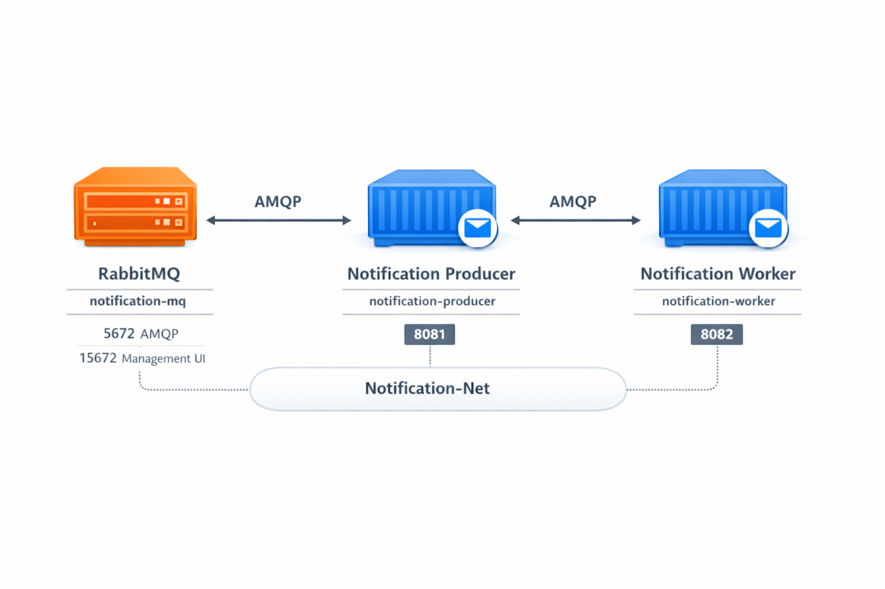

# 🚀 Notification Engine: Distributed System with RabbitMQ

A high-performance, asynchronous notification engine built using a multi-module **Spring Boot** architecture. This project demonstrates how to decouple services using **RabbitMQ** to ensure system reliability, scalability, and persistence.

---

## 🏗️ Architecture Overview

The system follows a distributed event-driven architecture. By utilizing a message broker, the Producer and Worker services operate independently, allowing the system to handle traffic spikes and ensuring no notifications are lost if the processing service is temporarily offline.



### System Components:
* **Producer API (Port 8081):** A RESTful service that receives notification requests and publishes them to RabbitMQ.
* **RabbitMQ (Port 5672):** The core message broker that manages exchanges and persistent queues.
* **Worker Service (Port 8082):** An independent consumer that retrieves messages from the queue for processing.
* **Docker Orchestration:** The entire infrastructure is containerized for seamless deployment and network isolation.

---

## 🛠️ Tech Stack

* **Backend:** Java 21 (LTS), Spring Boot 3.3
* **Messaging:** RabbitMQ (AMQP)
* **Data Models:** Java Records (Immutable DTOs)
* **Infrastructure:** Docker, Docker Compose
* **Testing:** Shell scripting & JSON templates

---

## 🚀 Getting Started

### 1. Prerequisites
Ensure you have **Docker** and **Maven** installed on your local machine.

### 2. Start the Infrastructure
Run the following command in the root directory to build and start the RabbitMQ broker and Spring Boot services:
```bash
docker compose up -d --build
```
---

## 🧪 Load & Functional Testing

The project includes ready-to-run shell scripts to simulate notification traffic.

### 🔹 Single Notification Test

```bash
./test-notification.sh
```

### 🔹 Bulk Notification Test

```bash
./bulk-notification-test.sh
```
